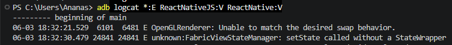

# HMP-14 — Location Search Fields on Candidate Expectations Screen Return No Results Due to `FabricViewStateManager` StateWrapper Error

**Severity:** Critical  
**Priority:** High

---

## Environment

| | |
|---|---|
| Device | Motorola Edge 30 Fusion |
| OS | Android 14 |
| App | Huntd Mobile Version 1.0.9 |

---

## Preconditions

User is completing Candidate registration flow.

---

## Steps to Reproduce

1. Proceed to the Expectations screen
2. Tap "Select Your Location" navigation item
3. Start typing any location query in the search field
4. Observe — no search results returned
5. Return to Expectations screen and tap "Office" checkbox
6. Tap "Desired Office Locations" navigation item
7. Start typing any location query in the search field
8. Observe — no search results returned

---

## Expected Result

Search field returns matching location results in real time as the user types.

---

## Actual Result

No search results returned for any input. `FabricViewStateManager: setState called without a StateWrapper` error logged via ADB logcat.

---

## Impact

This bug blocks the Candidate registration flow entirely. Location is a required field on the Expectations screen — the user cannot proceed to the next stage without selecting a location, and the search field returns no results for any input.

---

## Evidence

