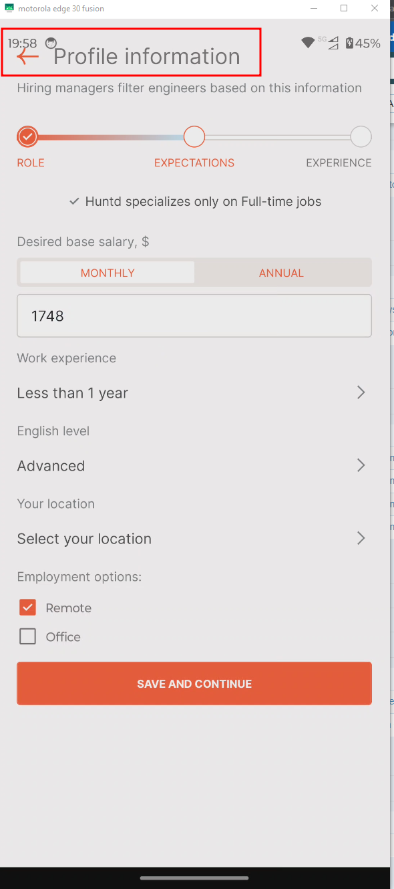
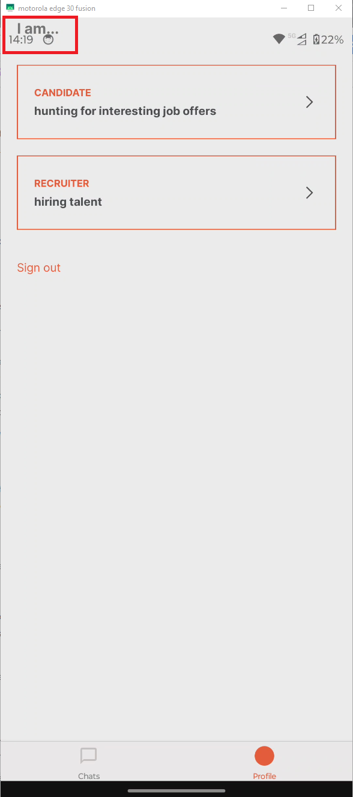
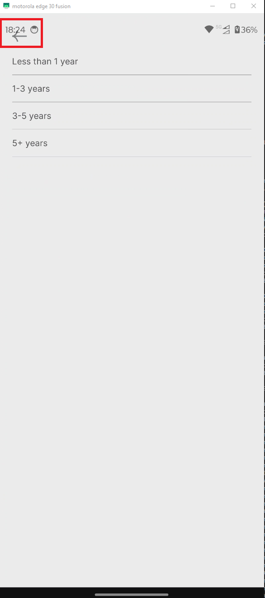

# HMP-15 — Registration Flow Headers and Back Buttons Overlap Native Device Status Bar

**Severity:** Minor  
**Priority:** Medium

---

## Environment

| | |
|---|---|
| Device | Motorola Edge 30 Fusion |
| OS | Android 14 |
| App | Huntd Mobile Version 1.0.9 |

---

## Preconditions

User navigates through registration flow.

---

## Steps to Reproduce

1. Navigate to the Profile Selection screen
2. Observe — "I am..." header overlaps the system status bar
3. Tap Candidate or Recruiter profile card
4. Observe — "Profile information" header and `[←]` back button overlap the system status bar
5. Navigate to any screen with a `[←]` back button, e.g. Work Experience selection screen
6. Observe — `[←]` back button position
7. Attempt to tap `[←]` back button in its center

---

## Expected Result

All page headers and screen titles are displayed below the device system status bar. `[←]` back button is fully visible and tappable within the safe area. App content respects device Safe Area Insets throughout the registration flow.

---

## Actual Result

Headers and `[←]` back button overlap the device system status bar area. Button is partially hidden behind system UI elements. User must tap very precisely on the button frame to trigger navigation.

---

## Root Cause

`SafeAreaView` component not implemented or incorrectly configured for registration flow screens.

---

## Evidence

