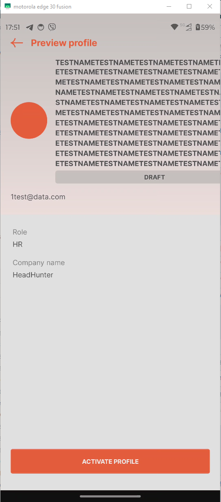

# HMP-22 — Profile Heading Displays Broken Layout for Excessively Long "First Name" or "Last Name" Values

**Severity:** Minor  
**Priority:** Medium

---

## Environment

| | |
|---|---|
| Device | Motorola Edge 30 Fusion |
| OS | Android 14 |
| App | Huntd Mobile Version 1.0.9 |

---

## Preconditions

User is logged in.

---

## Steps to Reproduce

1. Navigate to the Contacts screen
2. Enter 200 characters in the "First Name" field
3. Enter 200 characters in the "Last Name" field
4. Tap `[Save And Preview Profile]`
5. Observe the Profile Heading on the Preview Profile screen

---

## Expected Result

"First Name" and "Last Name" fields enforce a maximum character limit with a validation message, **or** long names are truncated with ellipsis in the Profile Heading. Profile Heading layout remains intact regardless of name length.

---

## Actual Result

- 200 characters accepted in both fields without validation
- Full name overflows the Profile Heading area
- Profile Heading layout completely broken
- Profile status badge barely visible behind overflowing text

---

## Evidence

