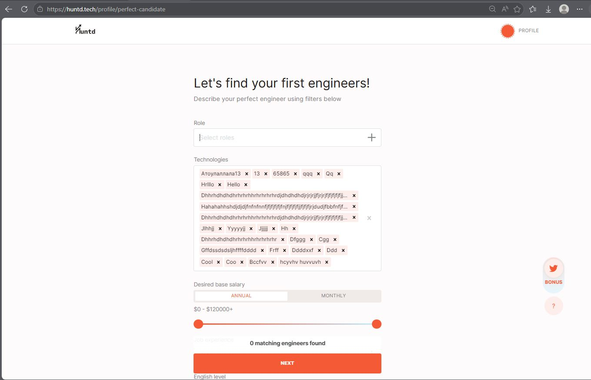

# HUNTD-38 — "Technologies" Multi-Select Field Accepts Invalid Free Text Input, Persisting Garbage Data to Database

**Status:** To Do  
**Severity:** Major  
**Priority:** High

---

## Environment

| | |
|---|---|
| Browser | Microsoft Edge 148.0.3967.70 (64-bit), Google Chrome 148.0.7778.168 (64-bit) |
| OS | Windows 10 Pro |

---

## Affected Areas

The same invalid data issue affects multiple "Technologies" multi-select fields:
- Recruiter registration — Perfect Candidate page
- Candidate registration — Role page
- Candidates List page — Technologies filter

---

## Preconditions

User is completing registration flow.

---

## Steps to Reproduce

1. Navigate to [Perfect Candidate](https://huntd.tech/profile/perfect-candidate) (as Recruiter) or [Role](https://huntd.tech/profile/candidate) (as Candidate)
2. Click on the "Technologies" multi-select field
3. Type any arbitrary string, e.g. `gg`, `hz`, `oo`, `1`
4. Observe the returned options

---

## Expected Result

The "Technologies" search field returns only valid, individual technology names from a controlled list.

---

## Actual Result

The search field returns invalid entries already present in the database, including:

- **Garbage/test data:** Dfggg, Cgg, Gffdssdsdsljhffffdddd, Ddddxxf, Ddd, Cool, Coo, Hzwgat, Z, My
- **Concatenated technologies as single entries:** MYSQL, MOBILE TESTING, MANUEL TESTING, API TESTING, JAVA SCRIPT

---

## Root Cause

The "Technologies" field fetches options dynamically from the database via API. No server-side or client-side validation prevents free text from being submitted and persisted. Invalid entries accumulate in the database and are returned to all users as selectable options.

---

## Evidence

---

## Additional Notes

This is a data integrity issue affecting all users of the platform. Invalid entries submitted by any user become visible to every other user in the Technologies filter and registration flow. The absence of an allowlist or input sanitization on both client and server side allows the database to be polluted indefinitely.