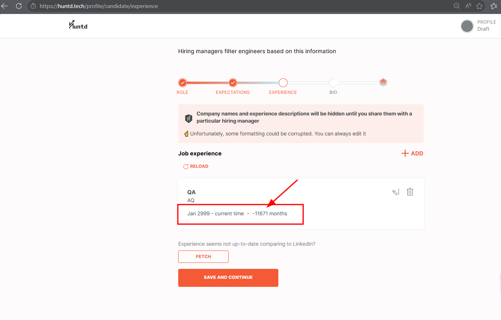

# HUNTD-50 — Start Date "Year" Field on Experience Page Accepts Future Year Values Resulting in Negative Experience Duration

**Severity:** Major  
**Priority:** High

---

## Environment

| | |
|---|---|
| Browser | Microsoft Edge 148.0.3967.70 (64-bit) |
| OS | Windows 10 Pro |

---

## Preconditions

User is completing Candidate registration flow.

---

## Steps to Reproduce

1. Navigate to [Experience](https://huntd.tech/profile/candidate/experience)
2. Click `[Add Manually]`
3. Enter a future year value, e.g. `2999`, in the Start Date "Year" field
4. Fill remaining required fields with valid data
5. Click `[Save]`
6. Observe the saved experience entry in Experience Preview

---

## Expected Result

Future year value is not accepted in the Start Date "Year" field. A validation message is displayed informing the user that the start date cannot be in the future.

---

## Actual Result

- Future year value `2999` is accepted without validation
- Form submits successfully with payload `startDate: "2999-1"`
- Experience entry displays `Jan 2999 - current time • -11671 months` — negative duration caused by the future start date

---

## Evidence

---

## Additional Notes

This bug is specific to Start Date only. A future year in the End Date field may be acceptable in some cases (e.g. a planned leave date) and was not flagged as a defect.