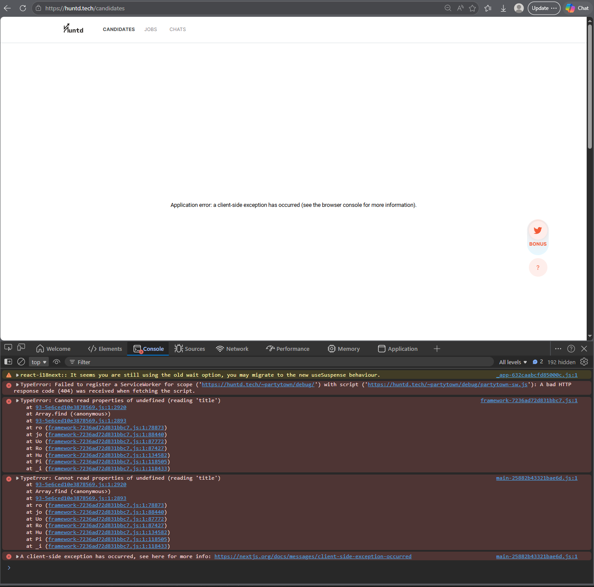
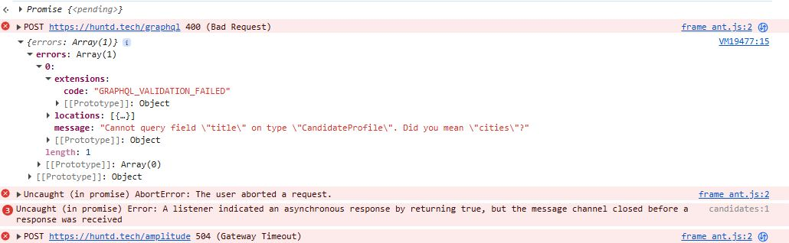
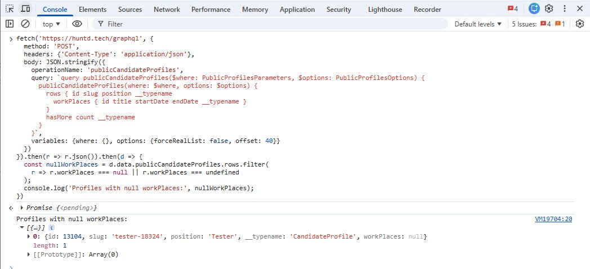

# HUNTD-60 — Candidates List Page Crashes for Recruiter Role During Pagination When Candidate Profiles with Null `workPlaces` Are Loaded

**Severity:** Critical  
**Priority:** High

---

## Environment

| | |
|---|---|
| Browser | Microsoft Edge 148.0.3967.70 (64-bit), Google Chrome 148.0.7778.168 (64-bit) |
| OS | Windows 10 Pro |

---

## Preconditions

User is logged in as a Recruiter.

---

## Steps to Reproduce

1. Navigate to [Candidates](https://huntd.tech/candidates)
2. Apply no filters
3. Click `[10 More]` button repeatedly until the application crashes with a blank white screen

---

## Expected Result

Additional candidate profiles load successfully on each `[10 More]` click. Application remains stable and functional.

---

## Actual Result

- Application crashes with a client-side exception
- Blank white screen displayed
- Error message: `Application error: a client-side exception has occurred`
- Console error: `TypeError: Cannot read properties of null (reading 'title')`

---

## Root Cause

The Recruiter UI component attempts to access `workPlaces[n].title` without null-guarding. When pagination loads a candidate profile with `workPlaces: null`, the property access throws a `TypeError` and crashes the application.

Problematic profile identified via DevTools console query:

```js
const nullWorkPlaces = d.data.publicCandidateProfiles.rows.filter(
  r => r.workPlaces === null || r.workPlaces === undefined
);
// Result:
// 0: {id: 13104, slug: 'tester-18324', position: 'Tester', workPlaces: null}
```

---

## Role-Specific Behavior

| Role | Browser | Result |
|---|---|---|
| Recruiter | Edge | 💥 Crashes |
| Recruiter | Chrome | 💥 Crashes |
| Candidate | Edge | ✅ No crash (tested up to offset 400) |
| Candidate | Chrome | ✅ No crash (tested up to offset 400) |

The Candidate role handles `null` workPlaces gracefully — the crash is isolated to the Recruiter-specific rendering component.

---

## Evidence



