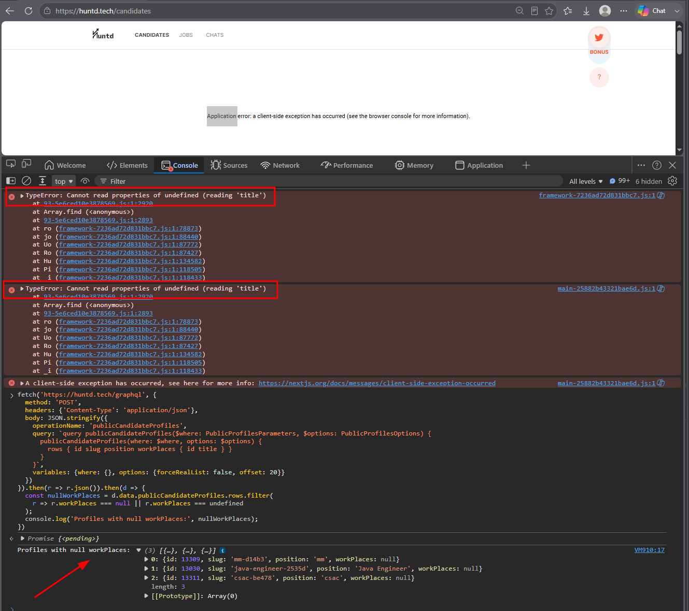
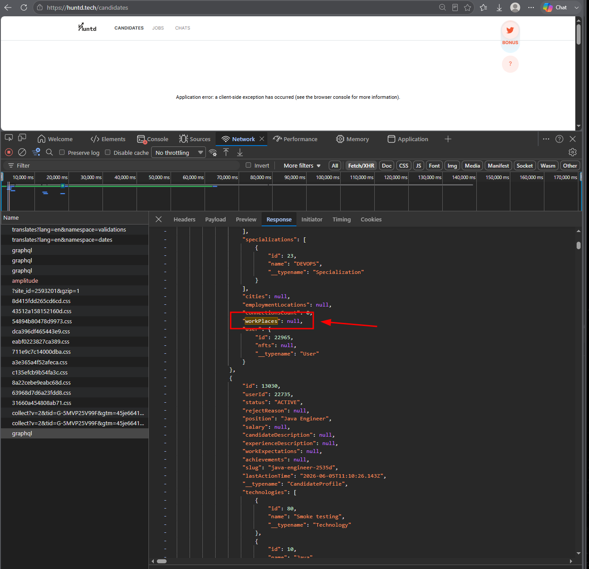

# HUNTD-62 — Candidates List Page Crashes for Recruiter Role During Pagination When Candidate Profiles with Null `workPlaces` Are Loaded

**Severity:** Critical  
**Priority:** High

---

## Environment

| | |
|---|---|
| Browser | Microsoft Edge 148.0.3967.70 (64-bit), Google Chrome 148.0.7778.168 (64-bit) |
| OS | Windows 10 Pro |

---

## Preconditions

User is logged in as a Recruiter.

---

## Steps to Reproduce

1. Navigate to [Candidates](https://huntd.tech/candidates)
2. Apply no filters
3. Click `[10 More]` button repeatedly until the application crashes with a blank white screen

---

## Expected Result

Additional candidate profiles load successfully on each `[10 More]` click. Application remains stable and functional.

---

## Actual Result

- Application crashes with a client-side exception
- Blank white screen displayed
- Error message: `Application error: a client-side exception has occurred`
- Console error: `TypeError: Cannot read properties of undefined (reading 'title')`

---

## Root Cause Investigation

The crash was first isolated by role — Recruiter crashes while Candidate navigates the same data without issue up to offset 400. This confirmed the bug is in the Recruiter-specific rendering component, not in the data itself.

A DevTools console query was used to identify the offending profiles at the crash offset:

```js
fetch('https://huntd.tech/graphql', {
  method: 'POST',
  headers: {'Content-Type': 'application/json'},
  body: JSON.stringify({
    operationName: 'publicCandidateProfiles',
    query: `query publicCandidateProfiles($where: PublicProfilesParameters, $options: PublicProfilesOptions) {
      publicCandidateProfiles(where: $where, options: $options) {
        rows { id slug position workPlaces { id title } }
      }
    }`,
    variables: {where: {}, options: {forceRealList: false, offset: 20}}
  })
}).then(r => r.json()).then(d => {
  const nullWorkPlaces = d.data.publicCandidateProfiles.rows.filter(
    r => r.workPlaces === null || r.workPlaces === undefined
  );
  console.log('Profiles with null workPlaces:', nullWorkPlaces);
})
```

The query returned profiles with `workPlaces: null` at the crash offset. The console error reports `undefined` rather than `null` because the Recruiter component attempts to access `workPlaces[n].title` — iterating into the array where `workPlaces[n]` resolves to `undefined` — rather than checking whether `workPlaces` itself is null before iterating. The Candidate component handles this case gracefully; the Recruiter component does not.

---

## Role-Specific Behavior

| Role | Browser | Result |
|---|---|---|
| Recruiter | Edge | 💥 Crashes |
| Recruiter | Chrome | 💥 Crashes |
| Candidate | Edge | ✅ No crash (tested up to offset 400) |
| Candidate | Chrome | ✅ No crash (tested up to offset 400) |

---

## Evidence



