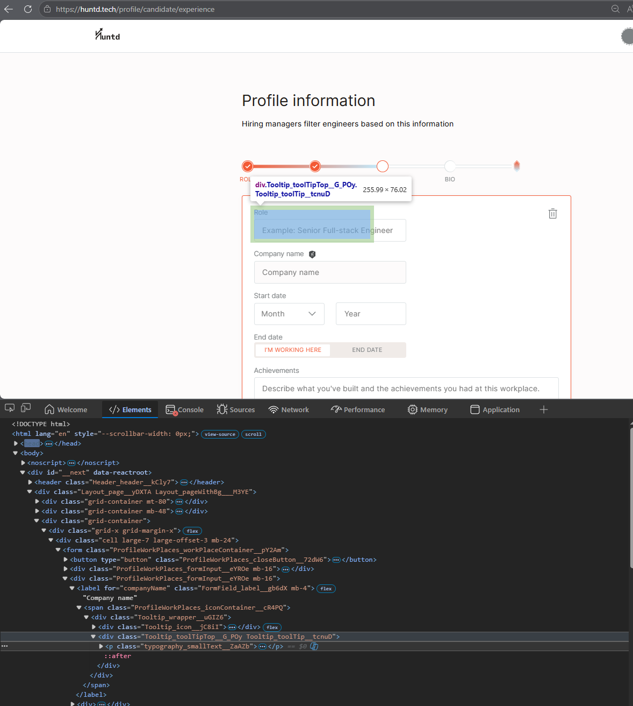
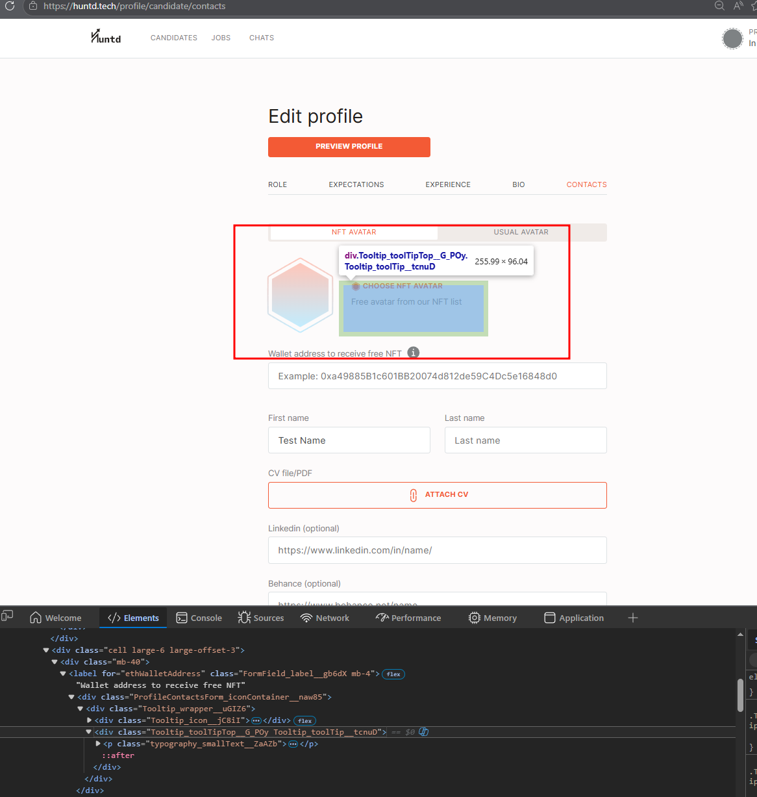
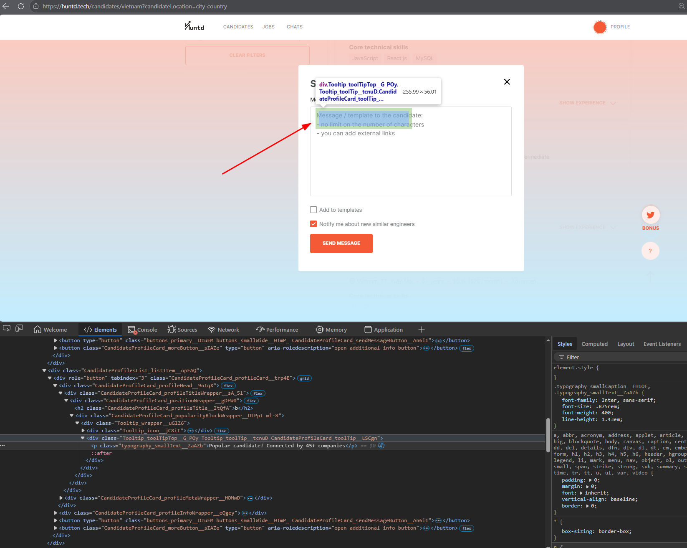

# HUNTD-67 — Misaligned `Tooltip_toolTipTop__G_POy` Component Intercepts Dialog Clicks and Restricts Clickable Areas Across Multiple Pages

**Severity:** Major  
**Priority:** High

---

## Environment

| | |
|---|---|
| Browser | Microsoft Edge 148.0.3967.70 (64-bit), Google Chrome 148.0.7778.168 (64-bit) |
| OS | Windows 10 Pro |

---

## Preconditions

User is on any page containing a form field or button adjacent to a Tooltip component.

---

## Steps to Reproduce

1. Navigate to any affected page (see Affected Areas)
2. Open DevTools → Elements tab
3. Locate `div.Tooltip_toolTipTop__G_POy` in the DOM
4. Observe the tooltip element overlapping adjacent UI elements
5. Attempt to click the affected element
6. Observe that the element does not respond to clicks in the blocked area

---

## Expected Result

The Tooltip element does not intercept clicks on underlying UI elements. All form fields and buttons are fully clickable across their entire visible area.

---

## Actual Result

- Form fields and buttons have restricted clickable areas due to the overlapping tooltip element
- Tooltip element (`z-index: 12`) intercepts clicks through modal dialogs (`z-index: auto`)
- Tooltip remains in the DOM with `z-index: 12` even when invisible (`opacity: 0`)

---

## Affected Areas

| Area | Page |
|---|---|
| "English Level" dropdown | Perfect Candidate page (Recruiter registration) |
| "Role" field | Experience page (Candidate registration) |
| `[Choose NFT Avatar]` button | Contact Information page (Candidate profile/registration) |
| "Desired Roles" dropdown | Role page (Candidate registration) |
| "Popular Candidates" indicator | Candidates page |

---

## Root Cause

The tooltip component uses `position: absolute` with `z-index: 12` and hides via `opacity: 0` rather than `display: none` or `visibility: hidden`. This means the invisible tooltip element remains in the DOM and continues to intercept pointer events, blocking clicks on underlying UI elements. Modal dialogs use `z-index: auto`, which is outranked by the tooltip's explicit `z-index: 12`.

```css
.Tooltip_toolTip__tcnuD {
  position: absolute;
  z-index: 12;
  opacity: 0;
}
```

```js
// Modal z-index
window.getComputedStyle(document.querySelector('.Modal_modalContent__drX1u')).zIndex
// Returns: "auto"

// Tooltip z-index
window.getComputedStyle(document.querySelector('.Tooltip_toolTipTop__G_POy')).zIndex
// Returns: "12"
```

---

## Evidence





