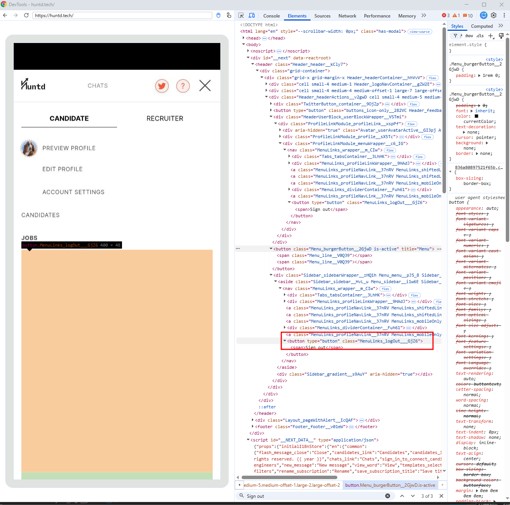
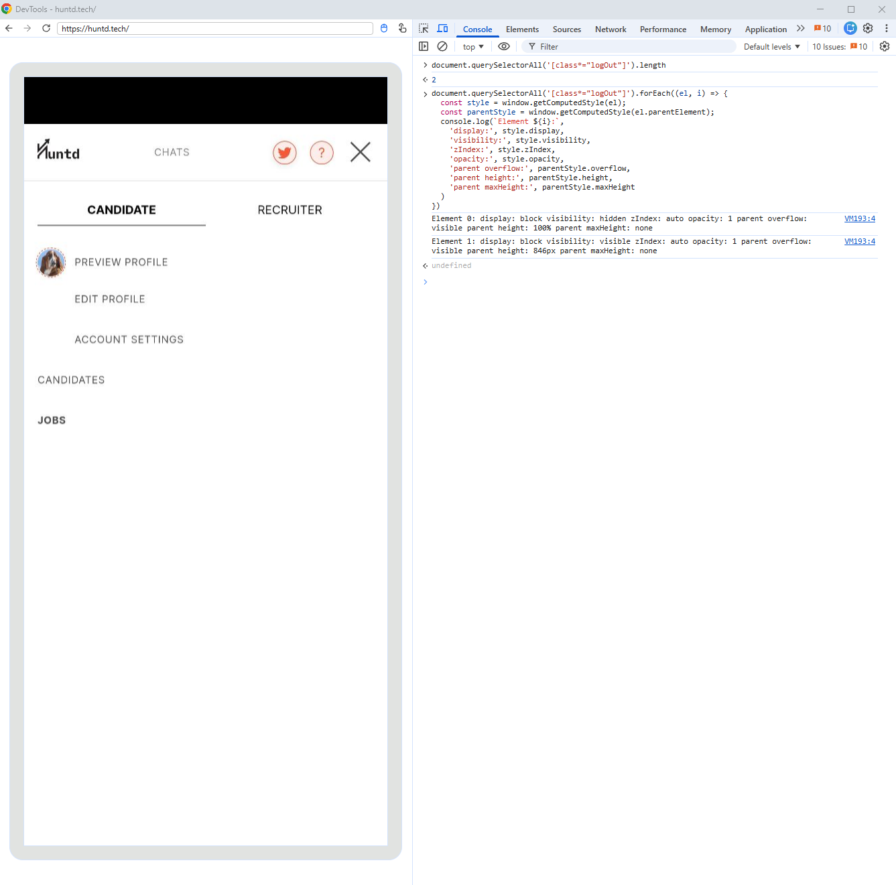

# HUNTD-76 — "Sign Out" Option Is Not Visible in Mobile Sidebar Menu of Web Application Opened in Mobile Browser

**Severity:** Major  
**Priority:** High

---

## Environment

| | |
|---|---|
| Device | Motorola Edge 30 Fusion |
| OS | Android 14 |
| Browser | Google Chrome Mobile |
| URL | https://huntd.tech/ |

> This bug affects the Huntd **web application** accessed via mobile browser — not the Huntd mobile app.

---

## Preconditions

User is authenticated and accessing the site via mobile browser.

---

## Steps to Reproduce

1. Tap the Profile icon to open the profile menu
2. Observe — "Sign Out" option is not visible
3. Attempt to scroll within the menu
4. Observe — no scroll is available

---

## Expected Result

"Sign Out" option is visible and accessible within the profile menu on mobile browser.

---

## Actual Result

- "Sign Out" option is not visible in the profile menu
- No scroll mechanism is provided to reach hidden menu items
- "Sign Out" button is rendered 12px below the visible viewport

---

## Root Cause

The mobile sidebar menu container has a fixed height of `846px`, exceeding the device viewport height of `834px` by 12px. The "Sign Out" button is positioned at the bottom of the container and rendered outside the visible viewport with no scroll mechanism provided.

Two `[class*="logOut"]` elements exist in the DOM:
- Element 0 (desktop menu): `visibility: hidden` — correctly hidden on mobile
- Element 1 (mobile sidebar): `visibility: visible` — but positioned outside viewport

"Sign Out" is accessible via the Desktop site switcher in the browser menu as a workaround.

> DevTools device emulation does not reproduce this issue — physical device testing was required to identify it.

---

## Evidence

