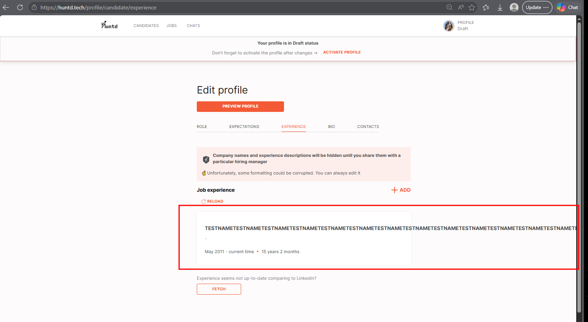
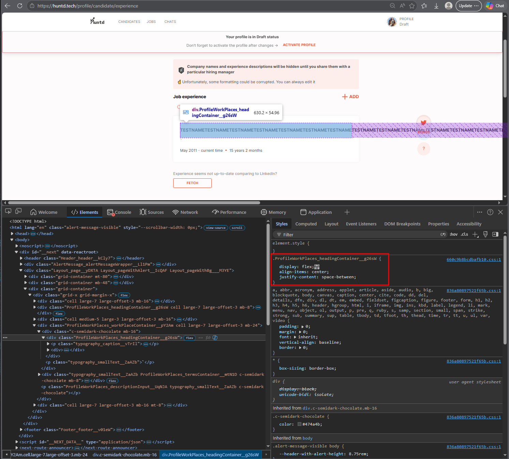

# HUNTD-78 — Experience Entry Card Layout Breaks on Candidate Experience Page When "Role" or "Company Name" Fields Contain Excessively Long Values

**Severity:** Major  
**Priority:** High

---

## Environment

| | |
|---|---|
| Browser | Microsoft Edge 148.0.3967.70 (64-bit) |
| OS | Windows 10 Pro |

---

## Preconditions

User is authenticated as Candidate.

---

## Steps to Reproduce

1. Navigate to [Candidate Experience](https://huntd.tech/profile/candidate/experience)
2. Click `[+ Add]` to open the experience form
3. Enter an excessively long value (up to 255 characters) in the "Role" and/or "Company Name" field
4. Fill remaining required fields with valid data
5. Click `[Save]`
6. Observe the experience entry card in Experience Preview

---

## Expected Result

"Role" and "Company Name" fields enforce a maximum character limit with a validation message, **or** the experience entry card truncates long text with ellipsis. Pen (edit) and Bin (delete) icons remain accessible regardless of input length.

---

## Actual Result

- Experience entry card layout breaks and text overflows horizontally beyond card boundaries
- Pen (edit) and Bin (delete) icons become inaccessible
- User cannot edit or delete the broken experience entry

---

## Root Cause

`ProfileWorkPlaces_headingContainer__g26sW` container is missing `overflow: hidden`. `typography_caption__vTrIl` paragraph element is missing `text-overflow: ellipsis` and `white-space: nowrap`.

---

## Evidence

---
## Additional Notes
 
This bug is related to [HUNTD-79](./HUNTD-79-role-company-name-fields-silently-discard-input-exceeding-255-chars.md) — while HUNTD-79 documents silent data loss when input exceeds 255 characters, this bug documents the UI consequence of values that reach but do not exceed the 255 character limit. Both point to the absence of client-side input length validation on the Experience page.