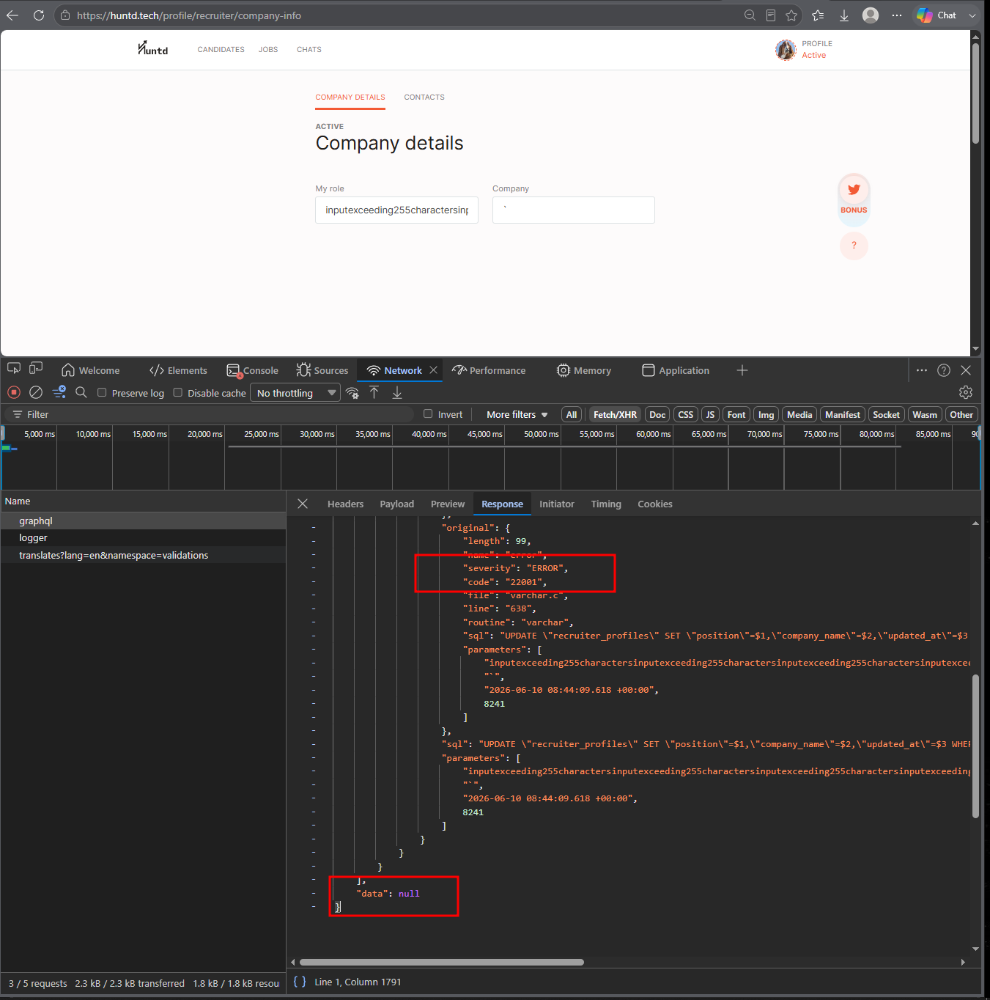

# HUNTD-79 — "Role" and "Company Name" Fields on Candidate Experience Page Silently Discard Input Exceeding 255 Character Limit

**Severity:** Major  
**Priority:** High

---

## Environment

| | |
|---|---|
| Browser | Microsoft Edge 148.0.3967.70 (64-bit) |
| OS | Windows 10 Pro |

---

## Preconditions

User is logged in as Candidate.

---

## Steps to Reproduce

1. Navigate to [Experience](https://huntd.tech/profile/candidate/experience)
2. Open an existing experience entry
3. Enter 256+ characters in the "Role" or "Company Name" field
4. Click `[Save]`
5. Observe — form closes as if saved successfully

---

## Expected Result

Client-side validation prevents input exceeding 255 characters and displays a validation message informing the user of the character limit. Form does not close without clearly indicating failure.

---

## Actual Result

- 256+ characters accepted without client-side validation
- No error message displayed — silent failure
- Form closes as if saved successfully but data is not saved

---

## Root Cause

The server enforces a `character varying(255)` database constraint. No corresponding client-side validation exists. The GraphQL mutation fails server-side and returns an error, but the UI dismisses the form without surfacing the failure to the user, resulting in silent data loss.

```json
{
  "errors": [{
    "message": "value too long for type character varying(255)",
    "locations": [{"line": 2, "column": 3}],
    "path": ["updateWorkPlace"],
    "extensions": {
      "code": "INTERNAL_SERVER_ERROR",
      "exception": {
        "name": "SequelizeDatabaseError",
        "parent": {
          "code": "22001",
          "routine": "varchar"
        }
      }
    }
  }],
  "data": null
}
```

---

## Additional Notes

Affects both "Role" and "Company Name" fields on the Experience page.

